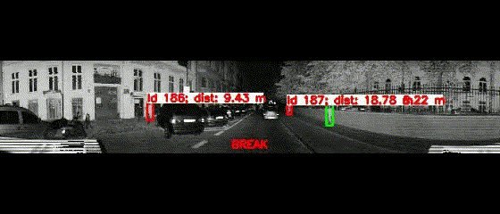

# Dangerous-situations-with-pedastrians

## Table of contents
* [Docs](#documentation)
* [General info](#general-info)
* [Technologies](#technologies)
* [Setup](#setup)

## Documentation
Here is a documentation of the source code by MkDocs: [Docs](https://szewczykszy.github.io/Dangerous-situations-with-pedastrians/)

## General info
This project is my thesis project: "3D point cloud analysis for traffic situational awareness". Project mainly consist of predicting dangerous situations on the road with pedastrians. Data are provided by Ouster OS1 LiDAR. Needed files to run code: '.pcap', '.json'.

Result video is shown below:

<p align="center">
  
</p>
	
## Technologies
Project is created with:
* Python: 3.9
* numpy: 1.25.2
* opencv-python: 4.8.1.78
* ouster-sdk: 0.10.0
* roboflow: 1.1.9
* ultralytics: 8.0.208
	
## Setup
- **Clone** this repository to your local machine. Run this command inside your terminal:

    ```bash
    git clone https://github.com/SzewczykSzy/Dangerous-situations-with-pedastrians.git
    ```
- Open this repository localy.

- Install all required packages:
  ```bash
  pip install -r requirements.txt
  ```

- To run the code write in terminal:
	```bash
 	python ./detect_dangerous_situations.py --weights weights/best_3000_s_100.pt --pcap-path ../PATH_TO_PCAP_FILE/sample.pcap --metadata-path ../PATH_TO_JSON_FILE/sample.json --tracker ./trackers/bytetrack.yaml --imgsz 1024 --device cpu --save=0 --save-video-path C:/PATH_TO_REPOSITORY/Dangerous-situations-with-pedastrians/results_mp4/result.mp4    
 	```
### Arguments
There are possible arguments:
* --weights: path to trained YOLOv8 weights
* --pcap-path: path to `.pcap` file
* --metadata-path: path to `.json` file
* --tracker: path to tracker file `.yaml` with parameters
* --imgsz: image size
* --device: calcuation on `cpu` or gpu (e.g. `0`, `1`)
* --save: if want to save result video `1`, else `0`
* --save-video-path: path to result video
